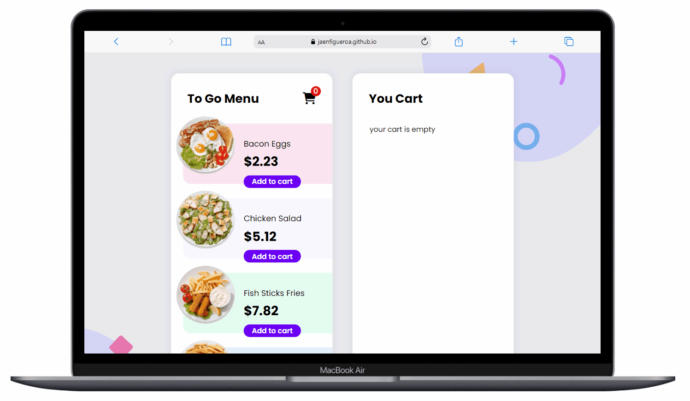
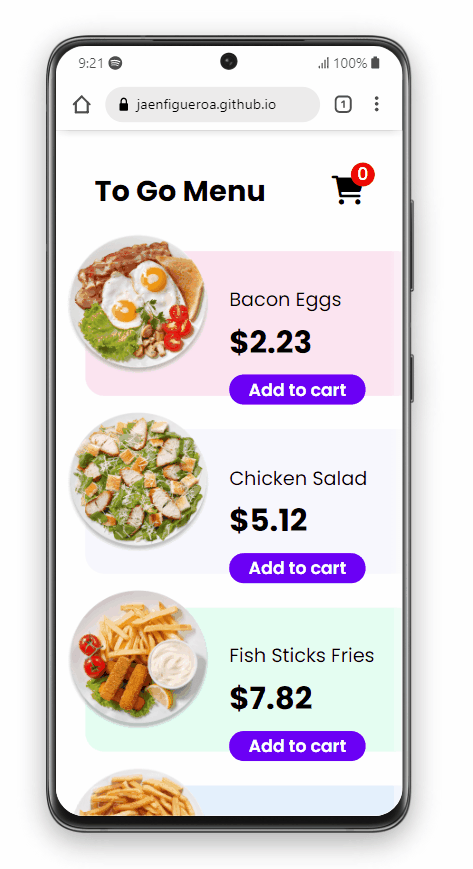

# eCommerce 💵🍽️

## 💡 Brief

In this project, I have developed an e-commerce component.

- ### Desktop preview

- ### Mobile preview

## 📌 Users should be able to:

- View the menu items or plates on the left side of the screen and add them to your cart on the right side.
- When there are no menu items in your cart, you should see a message that says, "Your cart is empty."
- When a plate is added to your cart, the Subtotal and Totals will automatically update.
- When products are in your cart, you should be able to increase and decrease the quantity.
- A user should not be able to mark the quantity as a negative number.
- If the quantity goes down to 0, the user will have the option to delete or remove the product from their cart entirely.
- Tax is based on the state of Tennessee sales tax: 0.0975
- After the user refreshes the page, they should still have the dishes added to their cart.

## 🔠 Fonts

- Poppins - https://fonts.google.com/specimen/Poppins?query=poppins

## 🎨 Colors

- border color: #d7d6fc
- Pattens Blue: #e1f0fe
- Ghost White: #f7f7ff
- White Ice: #defef0
- background color: #EFF0F6
- primary purple: #6B00F5

## 🚀 Challenge finished

This challenge was developed with the following languages:

 
 
  &nbsp; &nbsp;

## 🌍 Website

You can try my final result of the challenge [here](https://jaenfigueroa.github.io/eCommerce).

